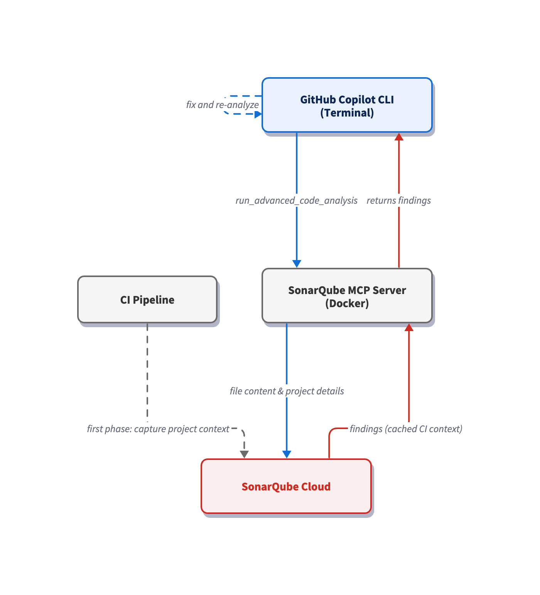

# Get going with SonarQube Agentic Analysis and GitHub Copilot CLI

> Last verified: May 2026

## TL;DR overview

* SonarQube Agentic Analysis verifies code generated by GitHub Copilot CLI, surfacing issues directly within the agent’s workflow.  
* Assists terminal-driven Copilot workflows where there’s no editor UI in the loop.  
* Compresses the development cycle from CLI prompting and PR-time review to in-session analysis, remediation, and verification.  
* Implementation involves two files (`mcp-config.json` and `copilot-instructions.md`) that together ensure advanced code analysis is run after every agent-driven implementation.

[AI coding agents](https://www.sonarsource.com/resources/library/what-is-an-ai-agent/) can produce code that compiles and passes local linting, but introduce issues that halt your CI or fail a PR. This evokes a frustrating situation wherein the developer must spend extra time re-prompting their way towards a solution. [SonarQube Agentic Analysis](https://docs.sonarsource.com/sonarqube-cloud/analyzing-source-code/agentic-analysis) removes this step. It exposes [SonarQube Cloud](https://docs.sonarsource.com/sonarqube-cloud)'s remote analysis engine to the AI agent through the [SonarQube MCP Server](https://docs.sonarsource.com/sonarqube-mcp-server), so that the agent can analyze its own output before marking the task complete.

[This blueprint](https://github.com/sonar-solutions/sqaa-copilot-cli/blob/main/README.md) explores the setup for [GitHub Copilot CLI](https://github.com/features/copilot/cli), the terminal-based Copilot agent. The workflow sits in the Verify stage of the [Agent Centric Development Cycle](https://www.sonarsource.com/blog/the-future-is-ac-dc-the-agent-centric-development-cycle/) and uses [Microsoft's GCToolKit](https://github.com/microsoft/gctoolkit) (a Java library for GC log analysis) as the demo project.

## When to use this

- You drive Copilot from the terminal rather than an IDE, so there's no agent-mode UI reviewing each suggestion before it lands on disk.  
- You want [code verification](https://www.sonarsource.com/resources/library/code-verification/) inside the agent's session: the same rules your pipeline enforces applied to new code in seconds.

## What you'll achieve

- SonarQube MCP Server registered in the GitHub Copilot CLI's `mcp-config.json` and configured for Agentic Analysis  
- A `copilot-instructions.md` VERIFY directive at the project root that tells Copilot CLI to call `run_advanced_code_analysis` on every modified file before declaring the task done  
- A working Agentic Analysis loop (analyze, fix, and re-analyze) running in the terminal, with newly-surfaced issues resolved automatically

## Architecture



The SonarQube MCP Server runs as a Docker container with your workspace mounted at `/app/mcp-workspace` and communicates with the CLI over stdio. When Copilot CLI calls `run_advanced_code_analysis`, the MCP Server reads the modified file via the volume mount and sends its data to SonarQube Cloud, which restores the cached project context from your last CI scan and runs analysis with the precision of a full CI pipeline scan. Single-file analysis returns findings in seconds.

## Prerequisites

- **GitHub Copilot CLI** installed and authenticated  
- An active GitHub Copilot subscription  
- [**SonarQube Cloud**](https://www.sonarsource.com/products/sonarqube/cloud/) on a [Team or Enterprise plan](https://www.sonarsource.com/plans-and-pricing/sonarcloud/) with Agentic Analysis enabled   
- A completed CI scan (after you have enabled Agentic Analysis)  
- **Docker** up and running  
- A SonarQube Cloud **user token**. Create one under **My Account \> Security** on SonarQube Cloud. If Agentic Analysis was recently enabled, generate a fresh token as older tokens may not carry the required permissions.  
- Use of a supported [programming language](https://www.sonarsource.com/knowledge/languages/). Agentic Analysis is available for [Java](https://www.sonarsource.com/knowledge/languages/java/), [Python](https://www.sonarsource.com/knowledge/languages/python/), [JavaScript](https://www.sonarsource.com/knowledge/languages/js/)/[TypeScript](https://www.sonarsource.com/knowledge/languages/ts/), [CSS](https://www.sonarsource.com/knowledge/languages/css/), [HTML](https://www.sonarsource.com/knowledge/languages/html/), [XML](https://www.sonarsource.com/knowledge/languages/xml/), [C\#](https://www.sonarsource.com/knowledge/languages/csharp/), [C++](https://www.sonarsource.com/knowledge/languages/cpp/) and [VB.NET](https://docs.sonarsource.com/sonarqube-cloud/analyzing-source-code/languages/vb-net). [Secrets detection](https://www.sonarsource.com/solutions/secrets-detection/), [Docker](https://www.sonarsource.com/knowledge/languages/docker/), [Kubernetes](https://www.sonarsource.com/knowledge/languages/kubernetes/), and [Terraform](https://www.sonarsource.com/knowledge/languages/terraform/) are also supported. Check the [official docs](https://docs.sonarsource.com/sonarqube-cloud/analyzing-source-code/agentic-analysis) for the latest list.

**Demo project:** to keep up with this guide, fork [microsoft/gctoolkit](https://github.com/microsoft/gctoolkit) to your GitHub account, import it into SonarQube Cloud with CI-based analysis enabled, and clone it locally.

## Step 1 — Register the SonarQube MCP Server with the CLI

The Copilot CLI reads MCP server registrations from `~/.copilot/mcp-config.json`. If the file doesn’t exist yet, create the directory and open it in your editor.

Paste in the following configuration:

```json
{
  "mcpServers": {
    "sonarqube": {
      "command": "docker",
      "args": [
        "run", "-i", "--rm", "--init", "--pull=always",
        "-e", "SONARQUBE_TOKEN",
        "-e", "SONARQUBE_ORG",
        "-e", "SONARQUBE_PROJECT_KEY",
        "-v", "<ABSOLUTE_PATH_TO_YOUR_PROJECT>:/app/mcp-workspace:rw",
        "mcp/sonarqube"
      ],
      "env": {
        "SONARQUBE_ORG": "<YourOrganizationKey>",
        "SONARQUBE_PROJECT_KEY": "<YourProjectKey>"
      }
    }
  }
}
```

Replace the three placeholder values:

- `<ABSOLUTE_PATH_TO_YOUR_PROJECT>` — the full path to your project on disk (for example, `/Users/dev/gctoolkit`). Docker requires absolute paths; relative paths like `./` fail silently.  
- `<YourOrganizationKey>` — your SonarQube Cloud organization key.  
- `<YourProjectKey>` — your SonarQube Cloud project key, found on the **Project Information** page in SonarQube Cloud or in `sonar-project.properties`.

If you work across multiple SonarQube Cloud projects, note that the values above bind the server to *one* such project. To avoid configuring `~/.copilot/mcp-config.json` for every project, place the same config at `<your-project>/.mcp.json` instead and Copilot CLI auto-loads this workspace-scoped config (same `mcpServers` schema) when launched from anywhere inside the project. Keep in mind that `.copilot/mcp-config.json` at the project root is *not* a recognized path; only `.mcp.json` works for the workspace config. If you'd rather keep the workspace clean, set [`COPILOT_HOME`](https://docs.github.com/en/copilot/reference/copilot-cli-reference/cli-config-dir-reference) per-shell to a project-specific directory containing an `mcp-config.json`; the CLI then reads `$COPILOT_HOME/mcp-config.json` instead of the global config.

In our implementation, `SONARQUBE_TOKEN` is intentionally absent from the `env` block. Export it in your shell so Docker forwards it via the `-e SONARQUBE_TOKEN` arg without committing the token to a config file:

```shell
export SONARQUBE_TOKEN="<YourSonarQubeUserToken>"
```

Add the export line to `~/.zshrc` or `~/.bashrc` so it persists across CLI sessions. Keep in mind that the token must be a SonarQube Cloud **user token**.

The config above does not set `SONARQUBE_TOOLSETS` as the SonarQube MCP Server enables many toolsets by default. If the workspace is mounted and your SonarQube Cloud organization is enabled for Agentic Analysis, then advanced analysis will be enabled too. If you ever want to restrict the server to a subset of these tools, set `SONARQUBE_TOOLSETS` explicitly to a comma-separated list.

For SonarQube Cloud in the US region, add `-e`, `"SONARQUBE_URL"` to the `args` and `"SONARQUBE_URL": "https://sonarqube.us"` to the `env` block. EU-region users do not need to set `SONARQUBE_URL`.

One more thing to watch out for: if you've used the SonarQube MCP Server in VS Code, the Copilot CLI uses an `mcpServers` wrapper at the top level of the config file, while VS Code's `.vscode/mcp.json` uses `servers`. The two schemas are not interchangeable; the CLI expects `mcpServers` at the top level and a servers-wrapped config will register *no* servers.

## Step 2 — Verify the MCP connection

Navigate to your local project's root (the same path used in the `-v` mount) and launch the CLI:

```shell
cd ~/path/to/gctoolkit
copilot
```

Inside the CLI, list the registered MCP servers:

```
/mcp show
```

The `sonarqube` server should appear in the list. 

Then check that the SonarQube MCP Server tools are loaded:

```
/mcp show sonarqube
```

With Agentic Analysis enabled, `run_advanced_code_analysis` should appear in the tool list.

## Step 3 — Add VERIFY directives

Copilot CLI can now leverage Agentic Analysis, but won't necessarily utilize it unprompted. A `.github/copilot-instructions.md` file at the project root tells the agent when and how to use this toolset. The CLI knows to auto-load this file when launched from anywhere inside the project, per the [custom instructions docs](https://docs.github.com/en/copilot/how-tos/copilot-cli/customize-copilot/add-custom-instructions). The CLI also reads your `AGENTS.md`, `CLAUDE.md`, or `GEMINI.md` from the project root (if they exist).

If you haven’t already, create the file and supply the following directives:

```
# SonarQube Agentic Analysis — VERIFY Directive

## After generating or modifying code

You must strictly follow this analyze-then-commit workflow for every code
modification. No code is considered complete until it has passed the following
SonarQube verification loop:

1. Read Phase: After any modification or before commit, use the `Read` tool
   to load the current state of all relevant source files.
2. Analysis Phase: For every new or modified file, call
   `run_advanced_code_analysis` with:
   - `projectKey`: The SonarQube Cloud project key
   - `branchName`: The active development branch
   - `filePath`: Project-relative path (e.g., `src/main/java/MyClass.java`)
   - `fileScope`: `MAIN` or `TEST` depending on the code type
3. Evaluation & Remediation:
   - Call `show_rule` for every issue
   - Mandatory fix any issue with `impacts[].severity` of HIGH or BLOCKER, or any issue with `impacts[].softwareQuality` of SECURITY
4. Verification: Re-run analysis after fixes to confirm resolution and
   no regressions
```

Be as specific as possible here. A directive like "examine the code" is too vague to trigger a specific tool call; naming the exact tool(s) produces consistent behavior.

The [official Agentic Analysis docs](https://docs.sonarsource.com/sonarqube-cloud/analyzing-source-code/agentic-analysis) include a deeper, combined Guide-and-Verify directive template that also integrates [Context Augmentation](https://docs.sonarsource.com/sonarqube-cloud/analyzing-source-code/context-augmentation) for the Guide stage.

## Step 4 — Generate code with Agentic Analysis

With the directives set, switch Copilot CLI to [autopilot mode](https://docs.github.com/en/copilot/concepts/agents/copilot-cli/autopilot) (**Shift \+ Tab**). Autopilot lets the analyze-fix-verify loop run end-to-end without interruption. Supply the following prompt:

```
Add a CSV exporter to the sample module that writes parsed GC events to disk.
```

Copilot CLI plans the change, and then modifies and creates files in `sample/src/main/java/com/microsoft/gctoolkit/sample/`.

It next calls `run_advanced_code_analysis` per modified and created file. This MCP tool accepts one file per call; Copilot dispatches multiple calls concurrently when more than one file is modified:

The first round of analysis returns findings on the new code:

Here’s a breakdown of the issues surfaced by the analysis:

| File | Rule | Issue |
| :---- | :---- | :---- |
| `GCEventCsvAggregator.java` | `java:S3740` | Raw generic type without parameterization |
| `GCEventCsvAggregator.java` | `java:S1068` | Unused private field `rawList` |
| `GCEventCsvFileWriter.java` | `java:S4507` | Delivering code in production with debug features activated is security-sensitive (Security Hotspot) |
| `GCEventCsvFileWriter.java` | `java:S2095` | Resource not closed (`InputStream`) |
| `GCEventCsvFileWriter.java` | `java:S108` | Empty `catch` block |

## Step 5 — Resolve surfaced issues and re-analyze

After the first round of analysis, Copilot proceeds without further prompting. Working through the findings file by file, the agent applies a targeted fix per rule and then re-runs `run_advanced_code_analysis` to confirm.

In the demo run, the agent applied these fixes:

- `GCEventCsvAggregator.java` — parameterized the aggregator as `Aggregator<GCEventCsvAggregation>` (resolves `java:S3740`) and removed the unused `rawList` field (resolves `java:S1068`).  
- `GCEventCsvFileWriter.java` — closed the leaked `InputStream` (resolves `java:S2095`), replaced `e.printStackTrace()` with a logger call (addresses the `java:S4507` Security Hotspot, since `printStackTrace()` is a debug feature flagged for production review), and turned empty catch blocks into logged handlers (resolves `java:S108`). Write errors now log instead of disappearing.

The follow-up analysis came back clean: zero remaining findings on either modified file. The full loop—from code generation through code analysis, code remediation, and code verification—ran in a single Copilot CLI session with no user intervention after the initial prompt.

## Verify the setup

You can confirm that Agentic Analysis is in operation when you see this sequence in the terminal after prompting Copilot CLI to produce code:

1. Per the `copilot-instructions.md` directive, Copilot CLI calls `run_advanced_code_analysis` on each changed file  
2. SonarQube returns findings, surfacing issues or confirming a clean file  
3. If issues exist, Copilot looks up rules, applies fixes, and re-runs analysis  
4. Repeated analysis confirms issue resolution and the session completes

Two artifacts are configured during this workflow: `~/.copilot/mcp-config.json` (refer to Step 1\) and `.github/copilot-instructions.md` (refer to Step 3).

## What to know

- Agentic Analysis is in [open beta](https://docs.sonarsource.com/sonarqube-cloud/analyzing-source-code/agentic-analysis); consult the [product release lifecycle](https://docs.sonarsource.com/sonarqube-cloud/appendices/product-release-lifecycle/) for more information.  
- Agentic Analysis is available in SonarQube Cloud currently, and not yet available in SonarQube Server.  
- Requires a [Team or Enterprise plan](https://www.sonarsource.com/plans-and-pricing/).  
- If you plan to use Agentic Analysis together with Context Augmentation, you must use a self-hosted SonarQube MCP Server. The [embedded Cloud MCP endpoint](https://www.sonarsource.com/blog/announcing-native-mcp-server-in-sonarqube-cloud) does not currently support Context Augmentation.  
- Docker requires an absolute path for the `-v` bind mount. Relative paths (`./`, `../`) will fail silently.  
- The `branchName` parameter must correspond to an actual branch that SonarQube Cloud has already analyzed via CI; a branch that doesn’t have a CI analysis history will return empty results.  
- If your GitHub organization has Copilot policies configured, an admin may need to enable MCP server access in the org's [Copilot settings](https://docs.github.com/en/copilot/how-tos/administer-copilot/manage-mcp-usage/configure-mcp-server-access).

## Next steps

- Add the Guide stage with [Context Augmentation](https://docs.sonarsource.com/sonarqube-cloud/analyzing-source-code/context-augmentation) so that your agent receives the context it needs to remain compliant with your project’s structure and standards.  
- For alternative Agentic Analysis implementations, see our companion blueprints for [Codex CLI](https://www.sonarsource.com/resources/library/get-started-with-sonarqube-agentic-analysis-and-codex-cli/) and [Claude Code](https://www.sonarsource.com/resources/library/get-started-with-sonarqube-agentic-analysis-using-claude-code/).  
- Consult the official [Agentic Analysis documentation](https://docs.sonarsource.com/sonarqube-cloud/analyzing-source-code/agentic-analysis) for the complete reference on tools, supported languages, and configuration options.
